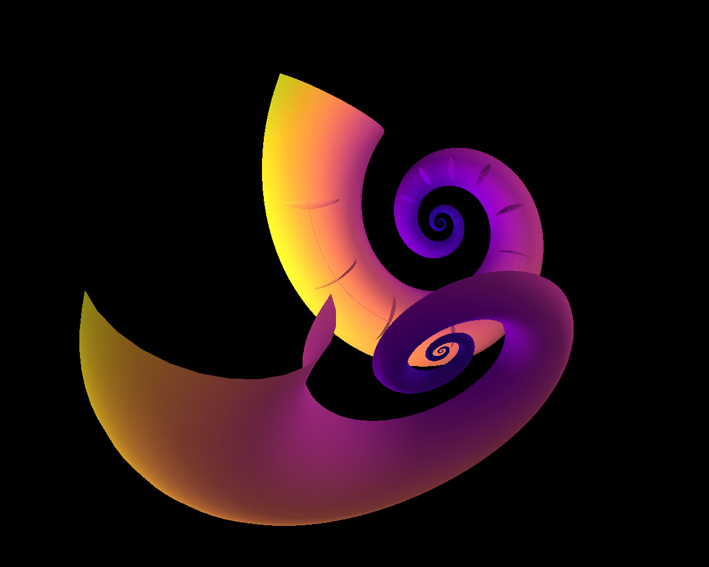
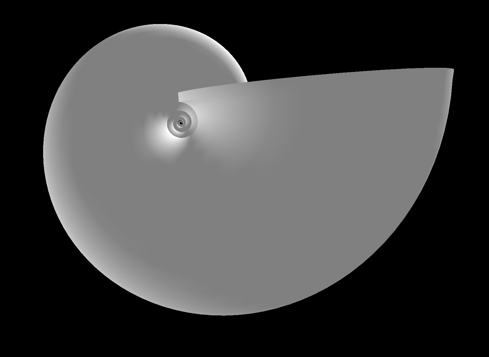
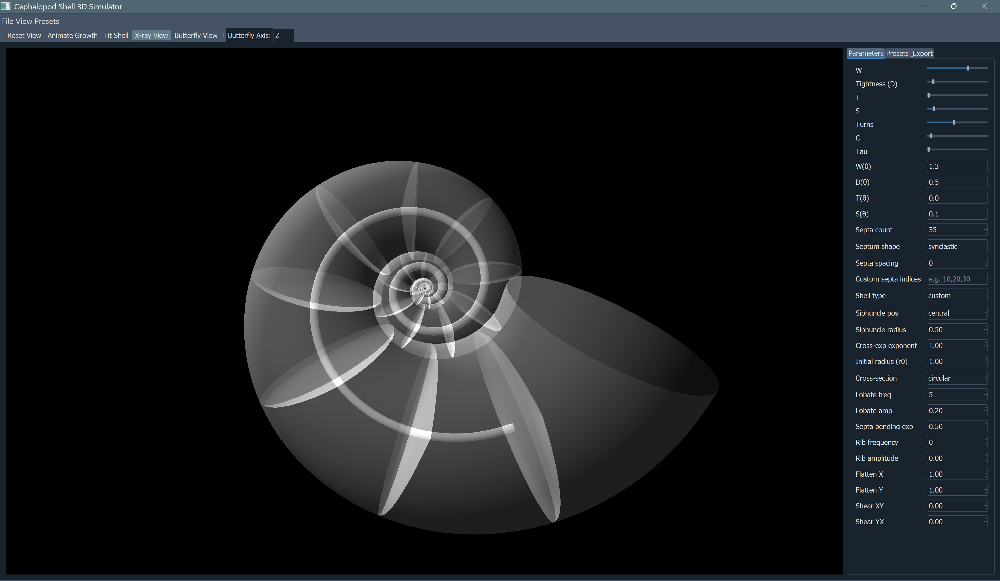

# 3D Cephalopod Shell Simulator

A Python PyQt5/PyQtGraph application for generating, visualizing, and interacting with 3D cephalopod shell models based on Raup’s logarithmic spiral and Okamoto’s differential-geometry parametric frameworks.

---

## Features

- Parametric shell geometry with whorl expansion (W), distance from axis (D), translation (T), curvature (C), torsion (Tau), and cross-section shape controls.
- Dynamic septa generation with synclastic or anticlastic shapes and customizable spacing.
- Siphuncle tube modeling (central or marginal) and taphonomic distortion/restoration toggles.
- Interactive 3D viewer with real-time parameter sliders.

## Installation

1. Make sure you have Python 3.8+ installed.
2. Clone this repository and navigate to the project root:
   ```bash
   git clone https://github.com/ada-carter/3D-Cephalopod-Shell-Simulator.git
   ```
3. Install dependencies:
   ```bash
   pip install -r requirements.txt
   ```

## Usage

Launch the GUI:
```bash
python main.py
```

Adjust parameters in the toolbar to update the shell mesh in real time. Use the **Restore** checkbox to invert taphonomic distortions.

## Screenshots

### Butterfly View


### Shell Before X‑ray


### Siphuncle & X‑ray View


## Dependencies

- PyQt5
- PyQtGraph
- NumPy

(see `requirements.txt` for exact versions)

## License

MIT
